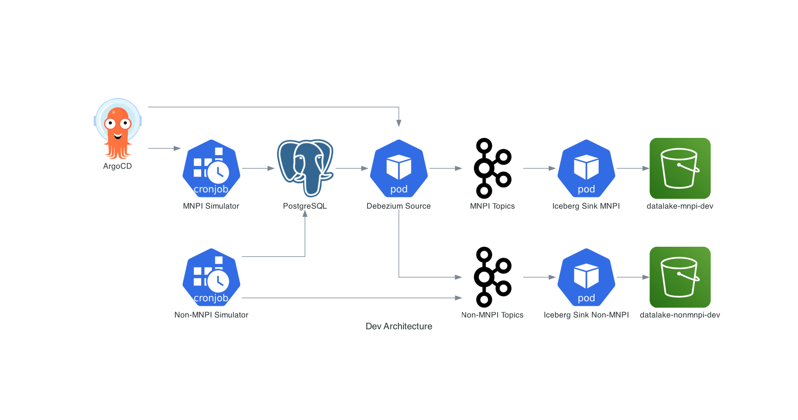
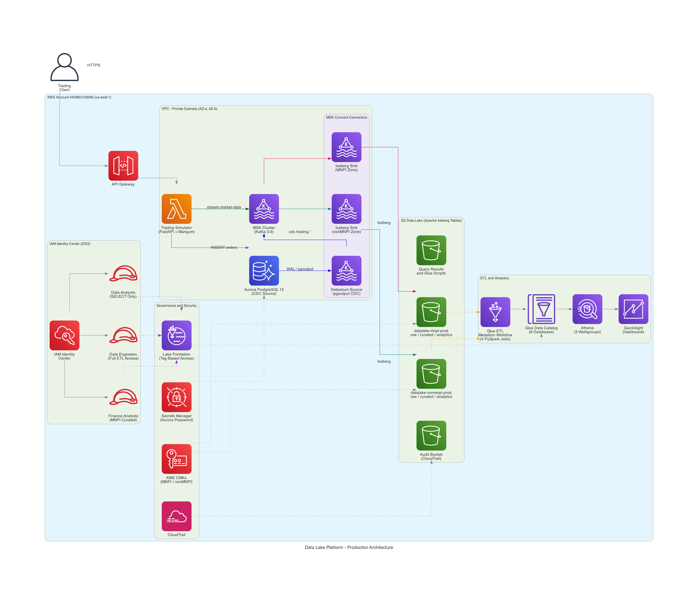

# Data Lake Platform

A secure, real-time data lake built for an asset management firm that handles both public and sensitive (MNPI) trading data. The platform captures every database change via CDC, streams market data through Kafka, and lands everything as Apache Iceberg tables on S3 — queryable within minutes through Athena and QuickSight.

The entire infrastructure is defined in Terraform (~200 AWS resources across 6 stacks) and runs in two modes: a fully managed **production** deployment on AWS, and a **local dev** environment on Kind that mirrors the same pipeline for fast iteration.

---

## Getting Started

### Prerequisites

```bash
# Install all tools at once (terraform, aws-cli, kind, kubectl, helm, etc.)
mise install

# Or manually: Terraform >= 1.9, AWS CLI v2, Task (https://taskfile.dev)
```

### Authenticate

```bash
# One command — configures SSO, opens browser login, verifies access
./scripts/reviewer-setup.sh
```

---

## Local Dev Environment

The local stack mirrors production's pipeline on your laptop using Kind (Kubernetes) + Strimzi (Kafka) + ArgoCD. Same CDC flow, same Iceberg tables — just running locally.



**How it works:** ArgoCD watches the local git repo (mounted at `/mnt/data-lake-platform`) and auto-syncs Kubernetes manifests. Two CronJobs run every minute, generating trading data into PostgreSQL. Debezium captures the changes via CDC and Iceberg sinks write Parquet files to S3. Commit to git, ArgoCD picks it up — same GitOps workflow as a real cluster.

### Spin It Up

```bash
# Creates Kind cluster, installs ArgoCD + Strimzi, builds images, deploys everything
task dev:up

# Tear it all down
task dev:down
```

### Dev Workflow

```bash
# Start Tilt for hot-reload inner dev loop
task dev:tilt

# Check cluster status
task dev:status
```

---

## Production Deployment

Production runs entirely on AWS managed services. No Kubernetes, no containers to manage — just Lambda, MSK, Aurora, and Glue.



**Two data paths, one destination:**
- **CDC path** — Lambda inserts orders, trades, and positions into Aurora. Debezium captures every WAL change, publishes to MSK, and Iceberg sinks write Parquet files to the MNPI bucket.
- **Direct produce** — Lambda publishes market data, accounts, and instruments straight to MSK. A second Iceberg sink writes these to the non-MNPI bucket.

Both paths land in Iceberg tables, flow through Glue ETL's medallion layers (raw → curated → analytics), and become queryable in Athena.

### Deploy

```bash
# Initialize all Terraform stacks
task tf:init-all

# Review what will be created (~200 resources across 5 stacks)
task tf:plan-all

# Deploy everything (tiers run in parallel where possible)
task deploy:all WORKSPACE=prod
```

### Post-Deploy (one-time setup)

```bash
# Upload MSK Connect connector JARs to S3
./scripts/upload-connector-plugins.sh prod

# Initialize Aurora CDC (replication slot + publication + seed tables)
./scripts/init-aurora-cdc.sh prod

# Kick off the Glue medallion workflow
AWS_PROFILE=data-lake aws glue start-workflow-run --name datalake-medallion-prod

# Verify the full pipeline end-to-end (~3 min)
task reviewer:e2e
```

### Terraform Stacks

Infrastructure is split into 6 stacks that deploy in dependency order:

```
Tier 0 (one-time):    account-baseline
                       Identity Center groups, LF settings, QuickSight

Tier 1 (parallel):    foundation              data-lake-core
                       VPC, subnets, NAT GW     S3 buckets, KMS, Glue DBs

Tier 2 (parallel):    security                compute
                       Lake Formation ABAC      MSK cluster, Aurora PG

Tier 3 (sequential):  pipelines
                       MSK Connect, Lambda, Glue ETL, Athena
```

Each stack has its own state file in S3. Stacks are workspace-driven — `dev` and `prod` workspaces control instance sizes, feature flags, and what gets created.

---

## Debugging & Validation

These tasks work against the production MSK cluster:

```bash
# Pipeline health
task reviewer:kafka-status          # MSK cluster + connector health
task reviewer:topics                # Kafka topics + partition counts
task reviewer:cdc-status            # Aurora replication slot, publication, row counts
task reviewer:connector-logs        # Tail connector logs (FILTER=ERROR for errors only)
task reviewer:s3-freshness          # Latest Iceberg data files per table

# Query the data
task athena:demo                    # Query all medallion layers via Athena
task reviewer:sample-queries        # Row counts across all 8 tables

# Full end-to-end verification (~3 min)
task reviewer:e2e
```

---

## Security Model

MNPI and non-MNPI data are isolated at every layer:

- **Separate S3 buckets** with separate KMS customer-managed keys
- **Separate Kafka topics** and Iceberg sink connectors
- **Separate Glue databases** per medallion layer per sensitivity zone
- **Lake Formation ABAC** — tag-based grants (`sensitivity`, `layer`) control who sees what

| Persona | Can Access | Layers |
|---|---|---|
| Finance Analyst | MNPI + Non-MNPI | Curated, Analytics |
| Data Analyst | Non-MNPI only | Curated, Analytics |
| Data Engineer | Everything | Raw, Curated, Analytics |

Athena queries against unauthorized tables return `AccessDeniedException` — no silent empty results.

---

## Project Layout

```
terraform/aws/
  stacks/              6 deployment stacks (account-baseline, foundation,
                       data-lake-core, security, compute, pipelines)
  modules/             14 shared Terraform modules

scripts/
  glue/                PySpark ETL scripts (medallion transforms)
  lambda/              Trading simulator Lambda source
  verify-e2e-pipeline.sh, init-aurora-cdc.sh, upload-connector-plugins.sh

dev/
  gitops/              ArgoCD ApplicationSets (Strimzi, producer-api, PostgreSQL)
  producer-api/        Kustomize base + overlays for the FastAPI producer

Taskfile.yml           All orchestration (deploy, destroy, debug, dev)
mise.toml              Tool versions (terraform, kubectl, helm, etc.)
```

---

## Further Reading

- **[`docs/REVIEWER_GUIDE.md`](docs/REVIEWER_GUIDE.md)** — Self-service reviewer onboarding with step-by-step verification
- **[`docs/documentation.md`](docs/documentation.md)** — Full platform docs (data model, security controls, ETL lineage)
- **[`docs/plans/`](docs/plans/)** — Design documents and implementation plans
