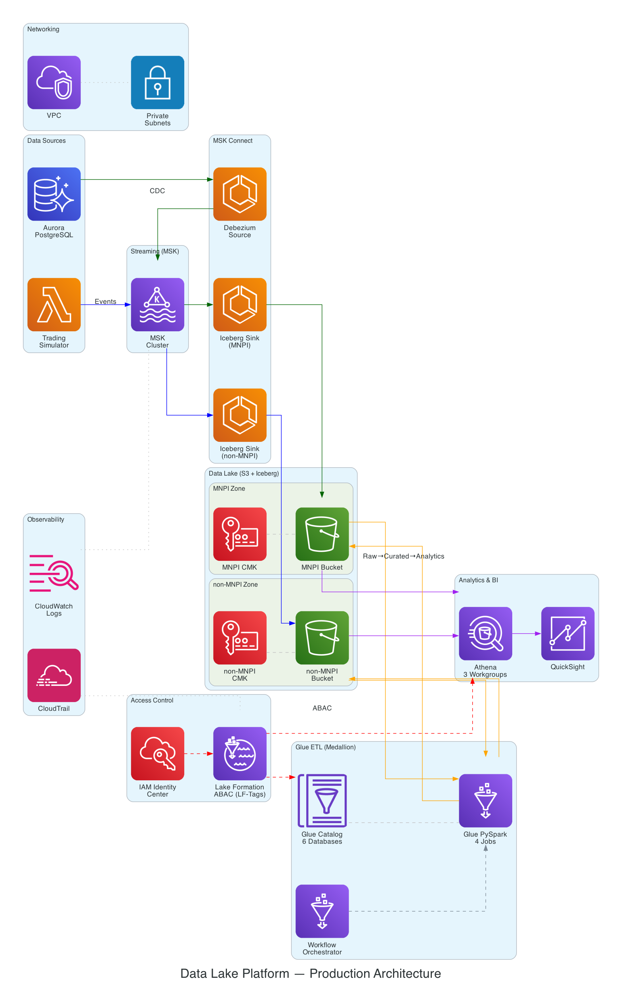

# Data Lake Platform

Secure, auditable AWS data lake with MNPI/non-MNPI isolation for an asset management firm.

Real-time CDC and streaming ingestion into Apache Iceberg tables on S3, with Lake Formation attribute-based access control (ABAC) and a medallion architecture powered by Glue ETL.



## Key Capabilities

| Capability | Implementation |
|---|---|
| **CDC Pipeline** | Aurora PostgreSQL &rarr; Debezium (MSK Connect) &rarr; MSK &rarr; Iceberg Sink &rarr; S3 |
| **Streaming Ingestion** | FastAPI producer &rarr; MSK &rarr; Iceberg Sink &rarr; S3 |
| **MNPI Isolation** | Separate S3 buckets, KMS CMKs, Kafka topics, Glue databases per sensitivity zone |
| **Lake Formation ABAC** | LF-Tags (`sensitivity` + `layer`) with grants per IAM Identity Center group |
| **Medallion Transforms** | Glue PySpark jobs: Raw &rarr; Curated (dedup + type cast) &rarr; Analytics (aggregates) |
| **Iceberg Tables** | Schema evolution, snapshot history, time-travel, Parquet data files |
| **BI / Reporting** | 3 Athena workgroups + QuickSight data source (via Athena connector) |
| **Infrastructure as Code** | 12 Terraform modules, workspace-driven dev/prod, ~200 resources |

## Architecture

### Access Control Model (ABAC via Lake Formation)

| Persona | Sensitivity | Layers | Permission |
|---|---|---|---|
| **Finance Analyst** | mnpi + non-mnpi | curated, analytics | SELECT |
| **Data Analyst** | non-mnpi only | curated, analytics | SELECT |
| **Data Engineer** | mnpi + non-mnpi | raw, curated, analytics | ALL + DATA_LOCATION_ACCESS |

Data Analysts querying MNPI tables receive `AccessDeniedException` from Lake Formation. Grants use LF-Tag expressions (AND across tag keys, OR within values) so new tables automatically inherit permissions.

### Medallion Layers

| Layer | MNPI Database | Non-MNPI Database | Description |
|---|---|---|---|
| **Raw** | `raw_mnpi_{env}` | `raw_nonmnpi_{env}` | Append-only CDC/streaming events |
| **Curated** | `curated_mnpi_{env}` | `curated_nonmnpi_{env}` | Deduplicated, typed, enriched |
| **Analytics** | `analytics_mnpi_{env}` | `analytics_nonmnpi_{env}` | Pre-aggregated summaries |

## Project Structure

```
terraform/aws/              AWS infrastructure (12 modules, workspace-driven dev/prod)
  modules/
    networking/              VPC, subnets, security groups, S3 gateway endpoint
    data-lake-storage/       S3 buckets (MNPI + non-MNPI + audit + query-results), KMS CMKs
    streaming/               MSK Provisioned cluster (2x m5.large brokers)
    glue-catalog/            6 Glue databases across medallion layers
    glue-etl/                4 PySpark jobs, workflow with conditional triggers
    identity-center/         3 IAM IC groups + permission sets + demo users
    lake-formation/          LF-Tags, tag-based ABAC grants, S3 registrations, IC integration
    service-roles/           IAM roles (Kafka Connect, Glue ETL) with least-privilege policies
    analytics/               3 Athena workgroups + named queries
    observability/           CloudTrail, QuickSight data source, CloudWatch log groups
    eks/                     EKS cluster for Strimzi (prod only)
    aurora-postgres/         Aurora PostgreSQL (source DB for CDC)
    msk-connect/             MSK Connect: Debezium source + 2 Iceberg sinks (for_each)
terraform/local/             Kind cluster + ArgoCD bootstrap (local dev only)
gitops/                      Kubernetes manifests for local dev (ArgoCD-managed)
  strimzi/                   Kafka + KafkaConnect + connectors (Kustomize overlays)
  strimzi-operator/          Strimzi operator Helm-based ApplicationSet
  sample-postgres/           Source PostgreSQL for local CDC demo
producer-api/                FastAPI trading simulator + Alpaca market data adapter
scripts/
  glue/                      PySpark ETL scripts (uploaded to S3 by Terraform)
  01_curated/                Athena SQL proving curated transforms
  02_analytics/              Athena SQL proving analytics transforms
  validation/                Access control + Iceberg time-travel validation queries
  upload-connector-plugins.sh  Download + package Debezium & Iceberg connector JARs
docs/                        Architecture diagrams and design documents
```

## Production Deployment

### Prerequisites

- Terraform >= 1.7.0
- AWS CLI v2 with SSO configured (`aws sso login --profile data-lake`)
- Python 3.11+ (for producer-api tests)

### Deploy

```bash
# Authenticate
aws sso login --profile data-lake

# Initialize and select workspace
task aws:init TF_WORKSPACE=prod

# Review the plan (~200 resources)
task aws:plan TF_WORKSPACE=prod

# Apply
task aws:apply TF_WORKSPACE=prod
```

### Post-Deploy Steps

```bash
# 1. Upload MSK Connect plugin JARs (one-time)
scripts/upload-connector-plugins.sh prod

# 2. Initialize Aurora CDC (replication slot + publication)
scripts/init-aurora-cdc.sh prod

# 3. Enable Debezium connector (set enable_debezium_connector = true, re-apply)
task aws:apply TF_WORKSPACE=prod

# 4. Run Glue medallion workflow
AWS_PROFILE=data-lake aws glue start-workflow-run --name datalake-medallion-prod

# 5. Verify data flow
task athena:query QUERY="SELECT count(*) FROM raw_mnpi_prod.mnpi_events" WORKGROUP=data-engineers-prod
```

### Terraform Modules

| Module | Resources | Key Outputs |
|---|---|---|
| networking | VPC, 2 private subnets, S3 endpoint, SGs | `vpc_id`, `private_subnet_ids` |
| data-lake-storage | 4 S3 buckets, 2 KMS CMKs, DENY bucket policies | `mnpi_bucket_id`, KMS ARNs |
| streaming | MSK cluster (2x m5.large, IAM auth, TLS) | `bootstrap_brokers` |
| glue-catalog | 6 databases, schema registry | `database_names` |
| glue-etl | 4 PySpark jobs, workflow, conditional triggers | `workflow_name`, `job_names` |
| identity-center | 3 groups, 3 permission sets | `*_group_id` |
| lake-formation | 2 LF-Tags, 14 grants, 2 S3 registrations, IC config | LF admin configured |
| service-roles | Kafka Connect + Glue ETL IAM roles | `*_role_arn` |
| analytics | 3 Athena workgroups | `workgroup_names` |
| observability | CloudTrail, QuickSight, CloudWatch | `cloudtrail_arn` |
| aurora-postgres | Aurora PG 15, Secrets Manager | `cluster_endpoint` |
| msk-connect | Debezium source + 2 Iceberg sinks | `connector_arns` |

### Security Highlights

- **S3 DENY bucket policies** block all `s3:GetObject`/`s3:PutObject` except Lake Formation SLR and explicitly allowed IAM roles
- **KMS CMK per sensitivity zone** — MNPI and non-MNPI data encrypted with separate keys
- **MSK IAM auth + TLS** — no plaintext Kafka traffic, IAM-based ACLs
- **Lake Formation overrides IAM** — removing default `IAMAllowedPrincipals` forces all access through LF grants
- **Secrets Manager** for Aurora credentials (not in Terraform state)
- **CloudTrail** audit logging to dedicated S3 bucket

## Local Development

For local development with Kind + ArgoCD (optional — not required for prod):

```bash
# Prerequisites: Kind, Task, kubectl
task up          # Bootstrap Kind + ArgoCD + deploy workloads
task status      # Check all resources
task down        # Tear down everything
```

See `terraform/local/` for the GitOps bridge pattern and `gitops/` for Kubernetes manifests.

## Testing

```bash
task test:unit          # Producer-api pytest (28 unit tests)
task alpaca:test        # Alpaca adapter transform tests (8 tests)
task test:integration   # Local pipeline integration tests
task validate:tf        # Terraform validate (local + AWS)
```

## Design Documents

- [Architecture Diagrams](docs/architecture-diagram.md) — Mermaid diagrams (data flow, isolation boundary, access matrix)
- [Platform Design](docs/plans/2026-02-28-data-lake-platform-design.md) — Full architecture design document
