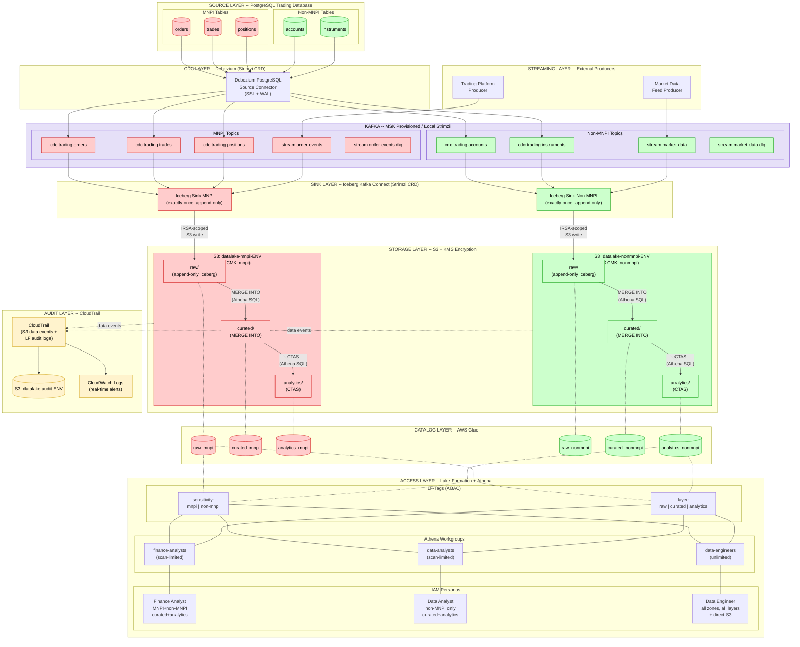
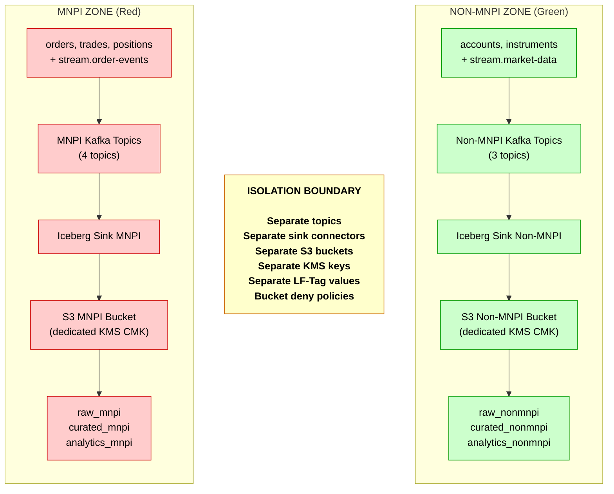
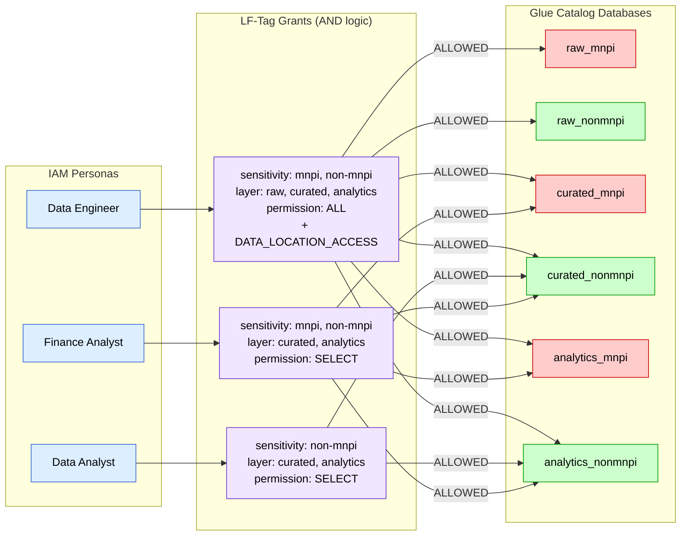
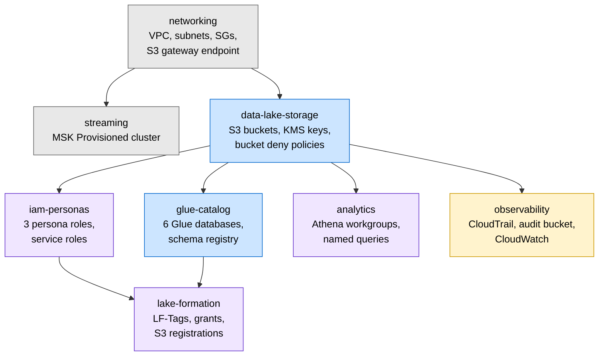

# Data Lake Platform Architecture Diagrams

## 1. End-to-End Data Flow

---

## 2. MNPI / Non-MNPI Isolation Boundary

---

## 3. Access Control Matrix -- Persona to LF-Tags to Databases

---

## 4. Access Control Summary Table

| Database | Finance Analyst | Data Analyst | Data Engineer |
|----------|:-:|:-:|:-:|
| `raw_mnpi` | DENIED | DENIED | ALL |
| `raw_nonmnpi` | DENIED | DENIED | ALL |
| `curated_mnpi` | SELECT | DENIED | ALL |
| `curated_nonmnpi` | SELECT | SELECT | ALL |
| `analytics_mnpi` | SELECT | DENIED | ALL |
| `analytics_nonmnpi` | SELECT | SELECT | ALL |

**Legend:** DENIED = Lake Formation blocks the query. SELECT = read-only via Athena. ALL = full access including DDL, plus direct S3 for Data Engineer.

---

## 5. Terraform Module Dependency Graph

---

## 6. Medallion Layer Detail

```mermaid
flowchart LR
    subgraph RAW["Raw Layer"]
        direction TB
        R_DESC["Append-only Iceberg tables\nFull CDC event history\nPartitioned by days(source_timestamp)\nWrite: Kafka Connect sink"]
        R_TABLES["orders | trades | positions\naccounts | instruments\n+ streaming tables"]
    end

    subgraph CURATED["Curated Layer"]
        direction TB
        C_DESC["Current-state tables\nDeduplicated via MERGE INTO\nPartitioned by days(updated_at)\nWrite: Athena SQL"]
        C_TABLES["orders | trades | positions\naccounts | instruments"]
    end

    subgraph ANALYTICS["Analytics Layer"]
        direction TB
        A_DESC["Pre-aggregated reports\nFull rebuild via CTAS\nPartitioned by months(report_date)\nWrite: Athena SQL"]
        A_TABLES["daily_trade_summary\nposition_report"]
    end

    RAW -->|"MERGE INTO\n(latest event per PK)"| CURATED
    CURATED -->|"CTAS\n(aggregation queries)"| ANALYTICS

    classDef raw fill:#fff0e0,stroke:#cc6600,color:#000
    classDef curated fill:#e0f0ff,stroke:#0066cc,color:#000
    classDef analytics fill:#e0ffe0,stroke:#009900,color:#000

    class RAW,R_DESC,R_TABLES raw
    class CURATED,C_DESC,C_TABLES curated
    class ANALYTICS,A_DESC,A_TABLES analytics
```

